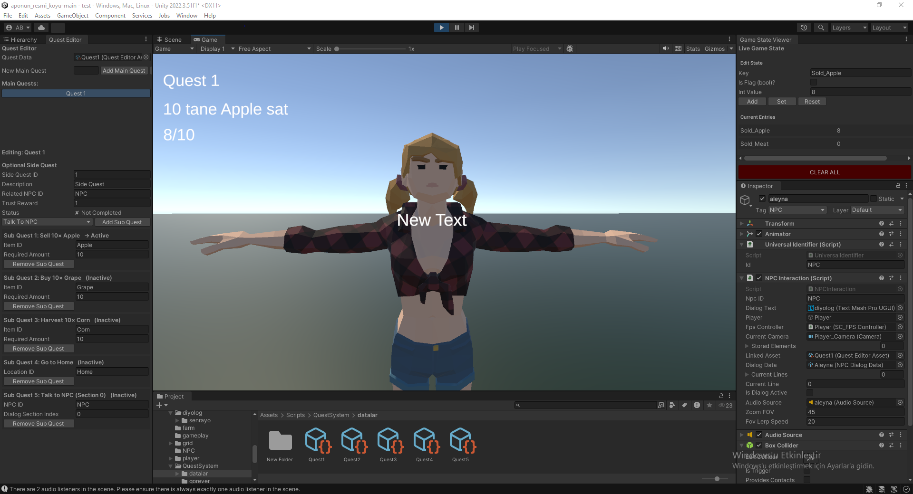

# 🧩 Modular Quest & Dialog System (Unity)

This project showcases a modular quest and dialog system developed in Unity using ScriptableObject-based architecture. It’s designed for RPGs, farming, or narrative-driven games that require structured quest flow and NPC interactions.

---

## 🎯 Features

- ✅ **ScriptableObject-based Main & Sub Quest Structure**
- 🔄 **Sequential quest progression**, with memory of past actions (persistent game state)
- 🧠 **Dynamic step types**: Buy, Sell, Harvest, Talk, GoTo
- 🗂️ **Quest Editor Asset** for custom quest design
- 🗣️ **Voice-supported NPC dialog system** with subtitles and quest-awareness
- 🧪 **Real-time debugging tools** (`GameStateTracker`, Quest Debug Viewer)
- 🖥️ **Quest UI integration** using TextMeshPro

---

## 🧱 System Architecture

```
[QuestEditorAsset]
    └── [QuestContainer]
         ├─ IQuestStep
         │   ├─ BuyItemStep
         │   ├─ SellItemStep
         │   ├─ HarvestItemStep
         │   ├─ TalkToNPCStep
         │   └─ GoToLocationStep
```

- Each `IQuestStep` checks against `GameStateTracker`.
- `ActiveQuestSystem` handles quest logic, transitions, and step validation.

---

## 🧩 Quest Editor Example

Quests and their steps are fully editable via Unity Inspector. You can define step type, item, amount, NPC ID, or location.

### 🖼️ Image: `quest_editor.png`
> Screenshot showing a QuestEditorAsset with substeps like Sell apple, Buy tomato, Go to location, Talk to NPC, etc.

```md

```

---

## 💾 Game State Tracker

The system remembers progress. If Quest 1 asks to sell 10 apples and Quest 2 asks 1000, the player doesn’t start from scratch — state persists.

- All values are tracked via string-based keys (`Sold_apple`, `Harvested_carrot`, etc.).
- Easily editable in live tools.

### 🖼️ Image: `game_state_debug.png`
> Screenshot showing debug panel with key = Sold_apple and value = 5

```md

```

---

## 🧠 Dynamic Quest Flow

- Quest steps use Dictionary lookups.
- You can stack multiple quest steps per quest.
- Steps are modular — no hardcoding.
- When a quest is completed, the next one starts **automatically**.
- Past actions affect next quests dynamically.

---

## 🗣️ Dialog System

NPCs have their own `NPCDialogData` assets with dialog sections. Each section includes subtitle lines and optional audio clips.

Dialogs:
- Are triggered with `E` key when near NPC
- Play audio + subtitle together
- Switch between sections depending on active quest

### 🖼️ Image: `dialog_npc.png`
> Screenshot showing `NPCDialogData` structure with subtitle lines and AudioClip references.

```md

```

---

## 📦 Inventory & Shop Integration

The player can interact with shopkeepers to buy or sell items. Each transaction updates the quest state automatically.

- Inventory is managed using slots and `ItemData` references.
- Sales update `GameStateTracker` keys such as `Sold_apple`, etc.


---

## 🚀 Future Improvements

- 🔊 Add step-complete and quest-complete sounds
- 📜 Include Quest Logs / Journal system
- 🌐 Localization support (Turkish, English, etc.)

---

Made with ❤️ using Unity.
