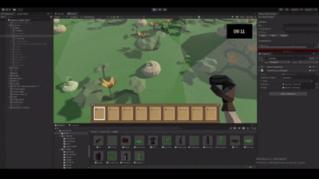
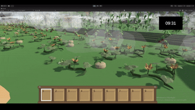
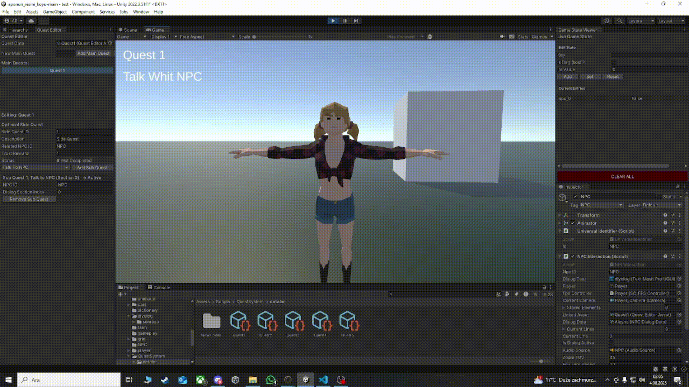
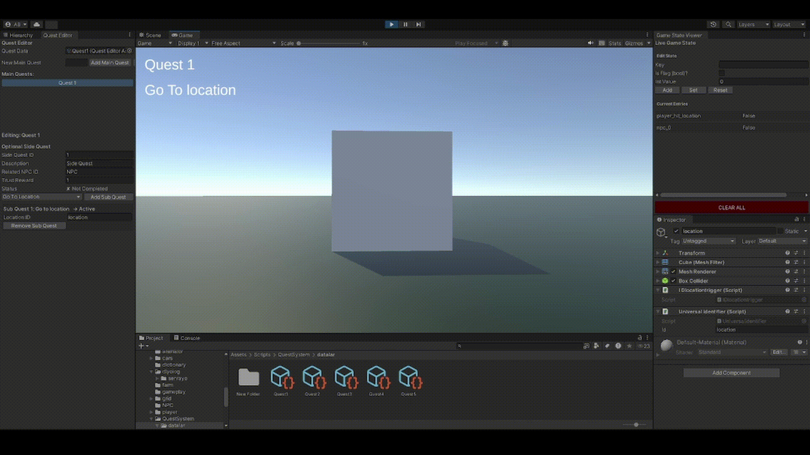

# 🤩 Modular Quest, Dialogue, Farming & Trading System (Unity)

This project is a fully modular and extensible system built in Unity. It features ScriptableObject-based quest and dialogue systems, dynamic farming mechanics, vehicle-driven field interactions, trading, save/load functionality, and NPC-specific relationship mechanics.

---

## 🌟 Core Features

* ✅ Main & Sub Quest System (ScriptableObject-based)
* ⟲ Sequential quest progression with memory of past actions
* 🧠 Quest step types: Buy, Sell, Harvest, Talk, GoTo
* 📂 Visual Quest Editor for quick creation
* 🗣️ NPC Dialogue System (subtitles + voice + trust level)
* 🧪 Real-time tracking tools (`GameStateTracker`)
* 📏 Save / Load system (inventory, quests, world state)
* 🎒 Inventory system with drag-and-drop trading UI
* 🚜 Vehicles for field interactions (planting, watering, harvesting, spraying)
* 🤝 NPC-specific Trust Level system & character types

---

## 🌺 Harvest System


Plants (from seed to crop) follow a multi-stage growth cycle. The system covers the entire farming loop:

### ⟳ Growth Mechanics

* Seeds (e.g., `carrot`, `tomato`, `apple`) start in the initial stage on placement
* Each prefab includes in `SeedData`:
  * Growth duration (days)
  * Daily prefab transitions
  * Watering requirement
  * Drying time threshold

### 💧 Watering System

* Each day, the system checks all `SeedPoint` objects under `Field`
* Watering status:
  * Not watered: growth stops, crop dries over time
  * Watered: progresses to next prefab stage

### 🧪 Manual Harvesting

* Fully grown crops become `Collectable`
* Player interaction:
  * Removes prefab from scene
  * Adds item to inventory
* Linked to `HarvestItemStep` in quest system

### ⟳ Vehicle Harvesting

* Harvesting vehicles can collect all ready crops automatically
* Fully integrated with inventory and quest systems

---

## 🌾 Trading System



* Players can open trade menus with NPCs
* Items can be dragged into the sell slot
* Pressing “E” opens the NPC's shop
* Prices defined in `ItemData`
* Global currency managed via `GameManager`
* Confirm sale using `Sales_UI.ConfirmSale()`
* Fully integrated with quest steps (`BuyItemStep`, `SellItemStep`)

---

## 💼 Inventory System



* Slot-based system (`ItemData` + count, icon, prefab)
* Supports stacking, removal, splitting, moving
* Drag-and-drop via UI
* Connected to trading interface

---

## 🗣️ NPC Dialogue & Trust Level System



Each NPC has:

* Unique `ID`, character type (friendly, neutral, aggressive)
* `Trust Level` ranging from 0–100

### ✨ Effects

* Quest availability: locked unless trust meets threshold
* Dialogue changes: NPC responses vary with trust
* Trade pricing: influenced by relationship

Trust increases through quests, gifts, or positive dialogue decisions.  
Dialogue assets are assigned to NPC prefabs and selected via `TrustLevel` conditions.

---

## 📍 Location-Based Quests



* Locations have assigned IDs
* Trigger completes step when player enters
* Tracked via `GameStateTracker`

---

## 🚜 Plant Mechanics


| 🚜 Vehicle Type   | Function                            |
| ----------------- | ------------------------------------ |
| Seeder            | Plants seeds automatically           |
| Water Sprayer     | Waters all plants in the field       |
| Pesticide Sprayer | Removes harmful effects              |
| Harvester         | Collects mature crops                |

* All mechanics act on `SeedPoint` components under each `Field`
* Easily extendable to support new vehicle types

---

## 🔹 Quest System Architecture

```
[QuestEditorAsset]
    └── [QuestContainer]
         ├─ IQuestStep
         │   ├─ BuyItemStep
         │   ├─ SellItemStep
         │   ├─ HarvestItemStep
         │   ├─ TalkToNPCStep
         │   └─ GoToLocationStep
```

---

## 📁 Save / Load System

* Data saved includes:
  * Quest progress
  * Inventory contents
  * NPC Trust Levels
  * Placed structures and crops
  * Vehicle positions and states

Data can be saved using JSON or Binary format.  
Connected via `GameManager.SaveGame()` and `LoadGame()`.

---

## 📖 Quest Journal & Tracker UI

* UI panel for **active and completed quests**  
* Displays quest title, description, and current step  
* Updates automatically via `GameStateTracker`  
* Provides player with a clear **quest history and progress tracking**  

---

## 🎥 Cutscene & Camera System

* **Fade-in/out transitions** for smooth scene changes  
* **Trigger-based camera shifts** (dialogue, quest events)  
* **CarAutoDrive integration** for waypoint-driven cutscenes  
* Enables cinematic storytelling while remaining fully data-driven  

---

## 🤖 NPC AI & NavMesh Integration

* **NavMesh-based movement** for NPCs and vehicles  
* Waypoint-driven logic for **patrolling and AutoDrive**  
* **NPC interactions** tied to location and quest steps  
* Ensures believable and automated world simulation  

---

## 🧠 GameStateTracker (Detailed)

* Central system handling global state synchronization:  
  * Quest progress  
  * Dialogue & trust levels  
  * Inventory contents  
  * Crop growth & watering state  
  * Vehicle states and positions  
* Connects directly with **save/load system** for persistence  

---

## 🗂️ Data-Driven Architecture

* **ScriptableObject-based design** across all systems:  
  * `QuestData`, `ItemData`, `DialogueData`, `SeedData`  
* All gameplay logic is **editable via Inspector** (non-hardcoded)  
* **Easily extensible**: new quest steps, items, or NPC behaviors can be added without modifying core systems  

---

## ⚡ Optimization & Extensibility

* **Modular SaveData structure** (supports crops, NPCs, quests, vehicles, inventory)  
* Efficient use of **NavMesh baking & occlusion culling**  
* Architecture designed for **scalability and performance**  
* Focus on writing **clean, reusable, and modular gameplay code**  

---

## 🚀 Planned Features

* 📖 Quest Journal (history & active tracking)
* 🌐 Language support (EN / TR)
* 🧐 Advanced AI / Dynamic NPC behavior
* 🤩 Crafting system (recipe-based production)
* 🔍 Mini-map & pin system
* 🔊 Audio feedback for quest completion

---

## 📆 Technologies Used

* Unity 2022.3 LTS
* C#
* ScriptableObject
* TextMeshPro
* Unity UI Toolkit
* JSON / Binary Save System

---

**Made with ❤️ using Unity.**
